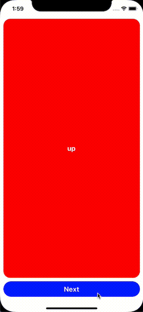

# react-native-simple-transition

An easy to use transition component for React Native.



## Usage

Install the library

```bash
yarn add react-native-simple-transition
```

Create a transition component and add the content as a child.
New components will be animated every time the key changes.

```tsx
import { WithPushTransition } from 'react-native-simple-transition';

const MyComponent = () => {
  const [count, setCount] = useState(0);
  
  return (
    <WithPushTransition style={{flex: 1}}>
      <Text key={count} onPress={() => setCount(count+1)}>
        This is component {count}.
      </Text>
    </WithPushTransition>
  )
}
```

Currently the only transition component is `WithPushTransition`.
More are planned to be added soon.

## WithPushTransition

### Optional properties

- `contentKey`: alternative to updating the child's `key` property
- `duration`: transition duration in milliseconds
- `style`: the style given to the transition component
- `easing`: an [easing function](https://reactnative.dev/docs/easing) for the transition
- `direction`: the direction of the transition; can be `left`, `right`, `up` or `down`
